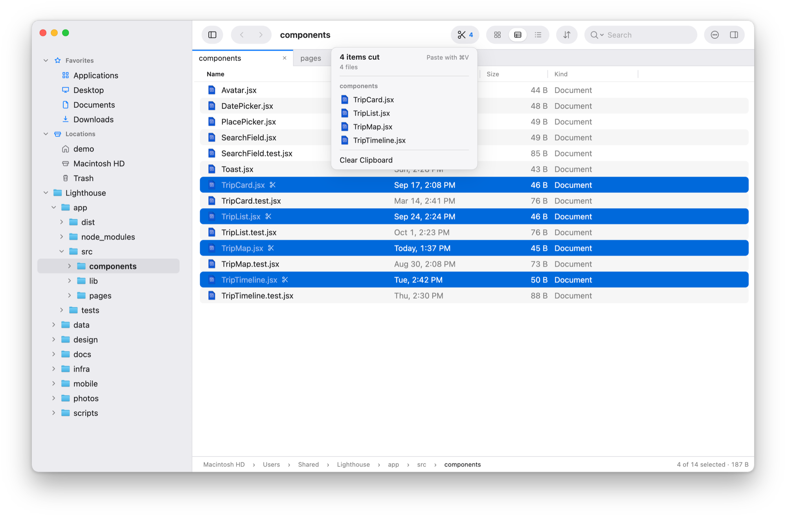
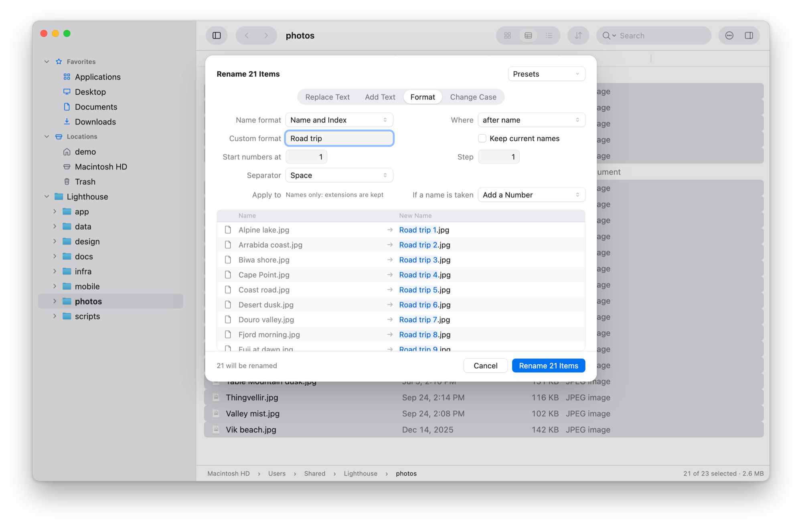
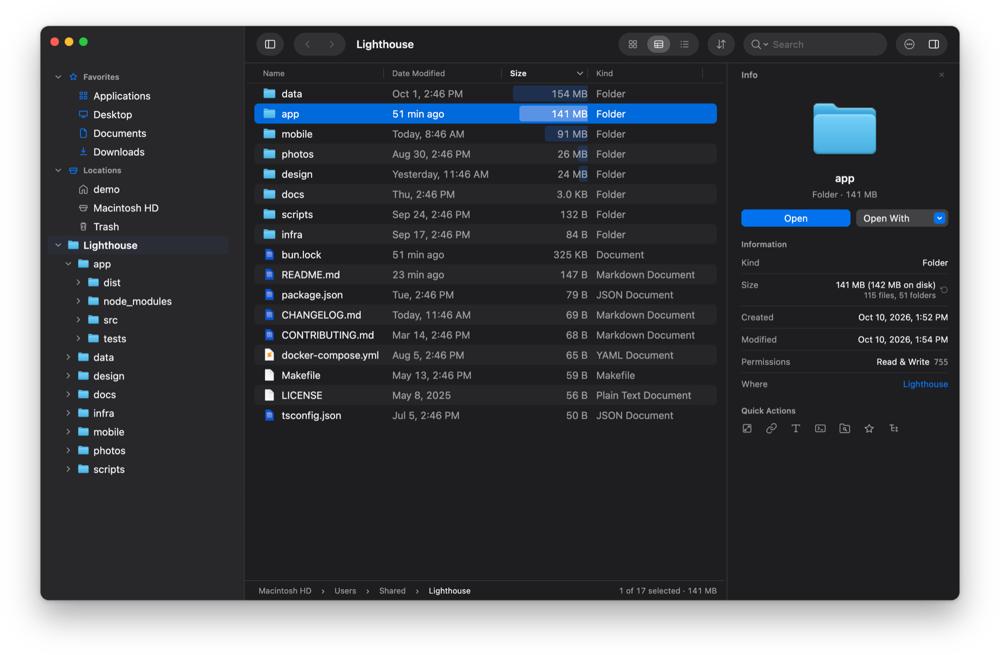

# File Trail

A Mac file browser with fast search, a real folder tree and true cut and paste. Everything else works the way it does in Finder.

<p align="center">
  
</p>

## Why switch from Finder

- **Search that works, and is fast.** Results appear as you type, from the folder you are in, by name or full path, in plain text, glob or regex. There is no index to wait for, and nothing left out for not being indexed.
- **A folder tree beside your files.** See where you are and what is around it, and open any folder's arrow to look inside without leaving.
- **Cut and paste files.** ⌘X and ⌘V move files, as they move text. What you cut or copied stays marked until you paste it, and a paste never destroys anything: what it replaces goes to the Trash.
- **Any folder in a few keystrokes.** ⌘K lists the folders you use most and finds any of them from a few letters. In a folder, start typing and the list narrows to the names that match.
- **Your keys.** Every command has a keyboard shortcut, and you can change any of them, two keys per command.
- **See what's taking the space.** Sort by size and every folder gets a bar, so the big ones stand out at a glance.

Switching costs nothing. File Trail keeps most of Finder's shortcuts, Quick Look on Space, drag and drop with other apps, tabs, and the sidebar's Locations.

## Search that keeps up with your typing

Finder hands search to Spotlight: by default it searches the whole Mac, it leaves out hidden and system files and anything excluded in Spotlight's settings, and matching a pattern means writing a raw Spotlight query. In File Trail, type in the search field and results appear as you type: everything under the folder you are in, each with the folder it lives in.

- **Plain text by default.** Switch to glob (`*.test.ts`) or regex when you need a pattern, and match against the name or the full path.
- **Widen or narrow without starting over.** One click moves the search from this folder to Home or the whole disk. The filter field trims what was found, by name or by folder, without searching again.
- **Results in any view.** Icons, List or Compact List, with columns of their own that you choose and sort.
- **It knows about Git.** Inside a repository, search can leave out `.git` and whatever `.gitignore` excludes, so build output stays out of the results.
- **Nothing to set up.** Search runs on a bundled copy of [`fd`](https://github.com/sharkdp/fd). There is no index to build and nothing to install.

Each tab keeps its own search, and a search keeps running while you look at another tab. To narrow just the folder on screen, start typing in the file list: it filters as you type, with no field to click first.

## A folder tree, not just a sidebar

Finder's sidebar holds shortcuts, not a tree. File Trail keeps a folder tree beside the files, as every screenshot on this page shows: the folder you are in, the folders around it, and the way back up.

- Open a folder's arrow to look inside without leaving where you are.
- Make one folder the top of the tree while you work inside a project, and go back to Home with ⇧⌘H.
- Your favorites and Locations sit above the tree: Home, Macintosh HD, other disks with an Eject button, and the Trash.
- Hide the tree when you want the room.

## Cut, copy and paste, with a clipboard you can see

<p align="center">
  
</p>

In Finder, moving files with the keyboard means ⌘C and then ⌥⌘V, and nothing marks the items waiting to be pasted. In File Trail, ⌘X cuts and ⌘V moves, in the same window or another. Cut and copied items stay marked until they are pasted, and a button in the toolbar counts them and lists them, so you can jump to one, take one off or clear the lot.

**Pasting is built not to lose your files.** When a paste would overwrite something, you choose: Skip, Keep Both, Replace, or for folders, Add Missing, which copies only what the folder there lacks. Anything replaced goes to the Trash. A move to another disk checks each copy before it removes the original, and if File Trail stops in the middle of a Replace, it picks up where it stopped the next time it opens and tells you where everything is. Undo (⌘Z) takes back renames, moves, copies and Move to Trash, one at a time.

## Any folder in a few keystrokes

<p align="center">
  
</p>

- **Go To (⌘K)** lists the folders you use most lately, with your favorites, and finds any folder you have opened from a few letters of its name. The folders you go to often come first, the way a browser's address bar ranks the sites you visit. Start with `/` or `~` to type a path, and Tab completes it.
- **Type in the file list** to narrow it to the names containing what you typed. There is no field to click first: the best match is selected, Backspace edits what you typed, and Esc brings the rest back. Press ⌘F and the same text becomes a search of the subfolders.
- **The path bar** is more than a label: click a folder to jump to it, click a `›` to see the folders at that level, or double-click the bar to edit the path as text.
- **Back and Forward** remember more than one step. Hold either button to pick from the folders it leads to.
- **The Go menu** has Home, Documents, Desktop, Downloads, Library, Macintosh HD, Applications and the Trash, like Finder's, each on a shortcut you choose.

## Your keys, your toolbar

Every command is on a keyboard shortcut, shown in the menus and listed in the built-in Help. In Finder, changing one means System Settings, App Shortcuts and the menu item's exact name; in File Trail, it is a list in Settings.

<table>
  <tr>
    <td align="center" width="50%"><br><b>The keyboard.</b> Two keys per command, with a warning before one is taken from another command.</td>
    <td align="center" width="50%"><br><b>The toolbar.</b> Arranged where it is, as in Finder: drag buttons in, along or out.</td>
  </tr>
</table>

## See what's taking the space

<p align="center">
  
</p>

Ask for a folder's size and File Trail measures it, and every folder inside it, in one pass. Sort the List view by Size and each row gets a bar, so the heavy folders stand out before you read a number.

Sizes are worked out for the folder you select or ask about, never for everything you pass while browsing, so opening a large folder stays instant. With the Info panel open, a folder you select in your home folder is measured by itself; Settings can turn that off.

## Rename many files at once

<p align="center">
  
</p>

Select several items and choose Rename. The Rename sheet replaces or adds text, numbers items or adds their date, or changes their case, and shows every new name before anything is renamed. Find and replace can use regular expressions, photos can be named by the date they were taken, and renames you repeat can be saved as presets. When a new name is already taken, you choose what happens: add a number, skip those items, or rename nothing.

## Three views, with real previews

<p align="center">
  
</p>

Icons view shows Quick Look previews of photos, PDFs and other documents. List view has columns for date, size and kind, and optionally date created and permissions. Compact List packs a folder into columns of names. Space opens Quick Look on whatever is selected.

Every tab has its own folder, history, folder tree, view and search, and every window its own tabs. Move a tab into a window of its own, or merge every window back into one.

## Make it yours

<p align="center">
  
</p>

File Trail follows the macOS Light and Dark setting, or stays in the one you pick. You choose the accent color and the zoom level, and Settings covers the everyday choices: which app edits text files and which terminal opens, what double-click and Return do, whether disk images open in a new window or a new tab, which columns List view and search results show, what search starts with, and whether your tabs and last folder come back at launch.

## Also in the box

- Favorites in the sidebar, with an icon of your choice for each, in the order you drag them to
- Open in Terminal and Copy Path on a key, and Open With for the apps you choose
- Duplicate, Move To, New Folder and Move to Trash, with the Info panel and Quick Look a key away
- Drag items in from Finder or other apps, and out to Finder, the desktop or any app, as from Finder
- Eject disks from the sidebar, and open disk images in File Trail instead of a Finder window
- The folder on screen stays current: what other apps add, rename or remove there shows up as it happens
- Hidden files on a key (⇧⌘.), and folders kept first when you want them
- Dates that read the way you would say them ("24 min ago", "Yesterday, 6:03 PM"), and the icons macOS itself draws for each file

## Install

File Trail is a signed and notarized app. Get the latest from the [releases page](https://github.com/mdemirhan/filetrail/releases):

1. Download `FileTrail-arm64.dmg` (or the `.zip`).
2. Move `File Trail.app` into your Applications folder.
3. Open it.

File Trail runs on Apple Silicon Macs with macOS 14 Sonoma or later.

## Build from source

You only need this for changes that haven't been released yet, or to work on File Trail itself. You need an Apple Silicon Mac, [Bun](https://bun.sh/), and the Xcode Command Line Tools (`xcode-select --install`) for the native part.

```bash
bun install
bun run desktop:start
```

That builds the app and its native helpers and launches it.

While working on the code:

```bash
bun run typecheck
bun run test
bun run lint
```

`bun run test` leaves out the few tests that write large files (stopping a long copy, filling a disk). Run them with `bun run test:release` before a release; `bun run ci` includes them too.

<details>
<summary>Making an app bundle</summary>

To make an app bundle under `apps/desktop/out`:

```bash
bun run desktop:make:mac:notarized   # signed and notarized, plus a ZIP and a disk image to share
bun run desktop:make:mac             # signed with your Developer ID, not notarized
bun run desktop:make:mac:adhoc       # signed ad hoc, for this Mac only
```

Signing uses the Developer ID Application certificate in `~/Documents/Apple Developer Certificates/developerID_application.cer` (or the one `MACOS_SIGN_CERT` names), with its private key in your keychain. Notarizing uses the `notarytool` keychain profile `filetrail` (or the one `MACOS_NOTARY_PROFILE` names); create it once with `xcrun notarytool store-credentials filetrail --apple-id <email> --team-id <team ID>`. `apps/desktop/scripts/make-macos-app.sh --help` has the details.

</details>

## How it is built

File Trail is an Electron app written in TypeScript and React, with a small native layer in C and Objective-C where the filesystem work has to be fast or has to be done the way macOS does it: copying, folder sizes, file icons and Quick Look previews.

```text
apps/desktop        The app: Electron main process, preload and the React interface
packages/contracts  The messages the interface and the main process exchange
packages/core       Listing, search, and copy, move and paste
packages/native-fs  The native macOS helpers
```
