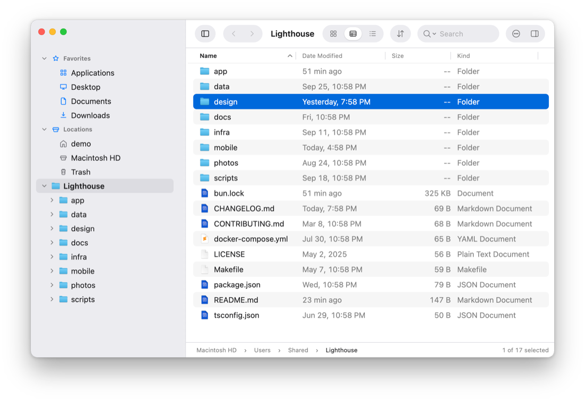
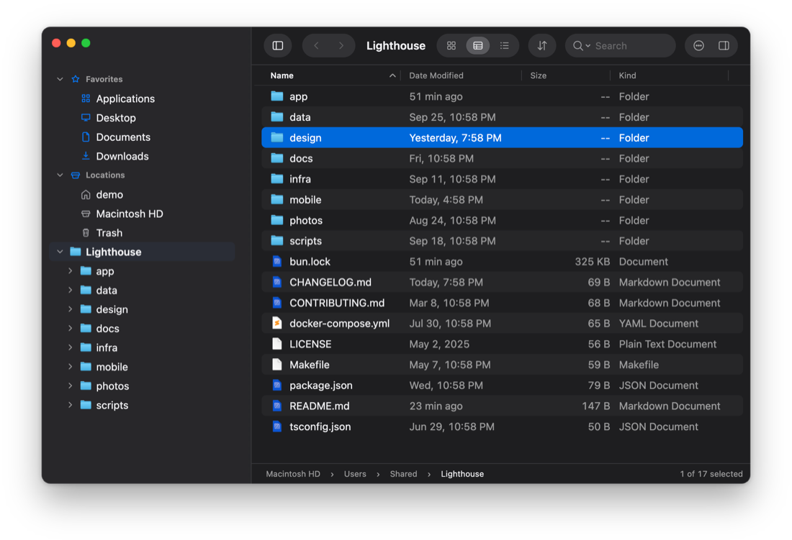

# File Trail

A file browser for macOS, built to fix the places where Finder falls short.

<p align="center">
  <picture>
    <source media="(prefers-color-scheme: dark)" srcset="docs/screenshots/folder-sizes-dark.png">
    
  </picture>
</p>

Finder covers the basics. File Trail is for the things it gets wrong or leaves out:

- **Search that keeps up with your typing.** By name or full path, in plain text, glob or regex, with nothing to index first.
- **Rename a batch and see every new name first.** Replace, add, number, date or change case, with a preview of each name and presets for the renames you repeat.
- **A folder tree, not just a sidebar.** You see where you are and what is around it.
- **Tabs that keep their place, and a clipboard you can see.** What you copied stays marked until you paste it.
- **Folder sizes when you ask.** One click measures a folder and everything in it.
- **Yours to arrange.** The toolbar, the keyboard shortcuts and the accent color are up to you.

Everything else works the way you expect a Mac app to.

## Search that keeps up with your typing

Type in the search field and results appear as you type: everything under the folder you are in, each with the folder it lives in.

<p align="center">
  
</p>

- **Plain text by default.** Switch to glob (`*.test.ts`) or regex when you need a pattern, and match against the name or the full path.
- **Widen or narrow without starting over.** One click moves the search from this folder to Home or the whole disk. The filter field trims what was found, by name or by folder, without searching again.
- **Results in any view.** Icons, List or Compact List, with columns of their own that you choose and sort.
- **It knows about Git.** Inside a repository, search can leave out `.git` and whatever `.gitignore` excludes, so build output stays out of the results.
- **Nothing to set up.** Search runs on a bundled copy of [`fd`](https://github.com/sharkdp/fd). There is no index to build and nothing to install.

Each tab keeps its own search, and a search keeps running while you look at another tab.

## Rename many files at once

Select several items and choose Rename. The Rename sheet replaces or adds text, numbers items or adds their date, or changes their case, and shows every new name before anything is renamed.

<p align="center">
  
</p>

Find and replace can use regular expressions. Photos can be named by the date they were taken. Renames you repeat can be saved as presets. When a new name is already taken, you choose what happens: add a number, skip those items, or rename nothing.

## See what is taking the space

Ask for a folder's size and File Trail measures it, and every folder inside it, in one pass. Sort the List view by Size and each row gets a bar, so the heavy folders stand out before you read a number. The first screenshot on this page shows it.

Sizes are worked out when you ask, not while you browse, so opening a large folder stays instant.

## Tabs, and a clipboard you can see

<p align="center">
  
</p>

Every tab has its own folder, history, folder tree, view, sort order and search. Copy in one tab and paste in another, or drag items onto a tab to move them there.

Copying a folder by mistake is easy to do and annoying to discover later, so File Trail makes the clipboard visible. Copied and cut items stay marked until they are pasted. A button in the toolbar counts them, and opens a list where you can jump to an item, take one off, or clear the lot.

When a paste would overwrite something, you decide what happens: Skip, Keep Both, Replace, or for folders, Add Missing, which copies only what the folder there lacks. Anything replaced goes to the Trash.

## Three views, with real previews

<p align="center">
  
</p>

Icons view shows Quick Look previews of photos, PDFs and other documents. List view has columns for date, size and kind, and optionally date created and permissions. Compact List packs a folder into columns of names. Space opens Quick Look on whatever is selected.

Dates read the way you would say them ("24 min ago", "Yesterday, 6:03 PM"), and files have the icons macOS itself draws for them.

## Get around without hunting

<p align="center">
  
</p>

- **The sidebar** has your favorites, and Locations as in Finder: Home, Macintosh HD, any other disks, and the Trash.
- **The folder tree** shows the folder you are in and the ones around it. Open a folder's arrow to look inside without leaving where you are, or make one folder the top of the tree while you work inside a project. Hide the tree when you want the room.
- **Go To (⌘K)** finds any folder you have opened before, or a favorite, from a few letters of its name. The folders you use most come first. Start with `/` or `~` to type a path, and Tab completes it.
- **Type in the file list** to narrow it to the names containing what you typed. There is no field to click first: the best match is selected, Backspace edits what you typed, and Esc brings the rest back. Press ⌘F and the same text becomes a search of the subfolders.
- **The path bar** is more than a label: click a folder to jump to it, click a `›` to see the folders at that level, or double-click the bar to edit the path as text.
- **Back and Forward** remember more than one step. Hold either button to pick from the folders it leads to.

## Make it yours

File Trail follows the macOS Light and Dark setting, or stays in the one you pick.

<table>
  <tr>
    <td align="center"><br>Light</td>
    <td align="center"><br>Dark</td>
  </tr>
</table>

Beyond that, you choose the accent color and the zoom level, and the parts you touch most are yours to arrange:

<table>
  <tr>
    <td align="center" width="50%"><br><b>The toolbar.</b> Arranged where it is, as in Finder: drag buttons in, along or out.</td>
    <td align="center" width="50%"><br><b>The keyboard.</b> Two keys per command, with a warning before one is taken from another command.</td>
  </tr>
</table>

Settings also covers the everyday choices: which app edits text files and which terminal opens, what double-click and Return do, which columns List view and search results show, what search starts with, and whether your tabs and last folder come back at launch.

## Also in the box

- Favorites in the sidebar, with an icon of your choice for each, in the order you drag them to
- Open in Terminal and Copy Path on a key, and Open With for the apps you choose
- Duplicate, Move To, New Folder and Move to Trash, with the Info panel and Quick Look a key away
- Hidden files on a key (⇧⌘.), and folders kept first when you want them
- Every command on a keyboard shortcut, shown in the menus and listed in the built-in Help

## Install

File Trail is released periodically as a signed and notarized app. Get the latest from the [releases page](https://github.com/mdemirhan/filetrail/releases):

1. Download `FileTrail-arm64.dmg` (or the `.zip`).
2. Move `File Trail.app` into your Applications folder.
3. Open it.

File Trail runs on Apple Silicon Macs. Releases are beta builds.

## Build from source

You only need this for changes that haven't been released yet, or to work on File Trail itself. You need an Apple Silicon Mac, [Bun](https://bun.sh/), and the Xcode Command Line Tools (`xcode-select --install`) for the native part.

```bash
bun install
bun run desktop:start
```

That builds the app and its native helpers and launches it.

While working on the code:

```bash
bun run typecheck
bun run test
bun run lint
```

`bun run test` leaves out the few tests that write large files (stopping a long copy, filling a disk). Run them with `bun run test:release` before a release; `bun run ci` includes them too.

<details>
<summary>Making an app bundle</summary>

To make an app bundle under `apps/desktop/out`:

```bash
bun run desktop:make:mac:notarized   # signed and notarized, plus a ZIP and a disk image to share
bun run desktop:make:mac             # signed with your Developer ID, not notarized
bun run desktop:make:mac:adhoc       # signed ad hoc, for this Mac only
```

Signing uses the Developer ID Application certificate in `~/Documents/Apple Developer Certificates/developerID_application.cer` (or the one `MACOS_SIGN_CERT` names), with its private key in your keychain. Notarizing uses the `notarytool` keychain profile `filetrail` (or the one `MACOS_NOTARY_PROFILE` names); create it once with `xcrun notarytool store-credentials filetrail --apple-id <email> --team-id <team ID>`. `apps/desktop/scripts/make-macos-app.sh --help` has the details.

</details>

## How it is built

File Trail is an Electron app written in TypeScript and React, with a small native layer in C and Objective-C where the filesystem work has to be fast or has to be done the way macOS does it: copying, folder sizes, file icons and Quick Look previews.

```text
apps/desktop        The app: Electron main process, preload and the React interface
packages/contracts  The messages the interface and the main process exchange
packages/core       Listing, search, and copy, move and paste
packages/native-fs  The native macOS helpers
```
