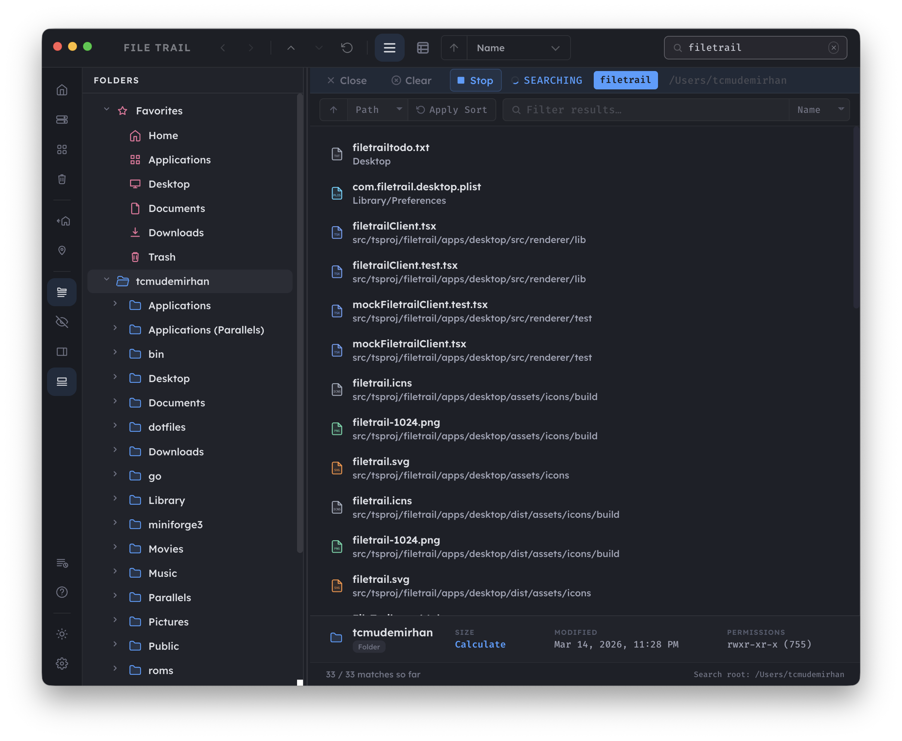
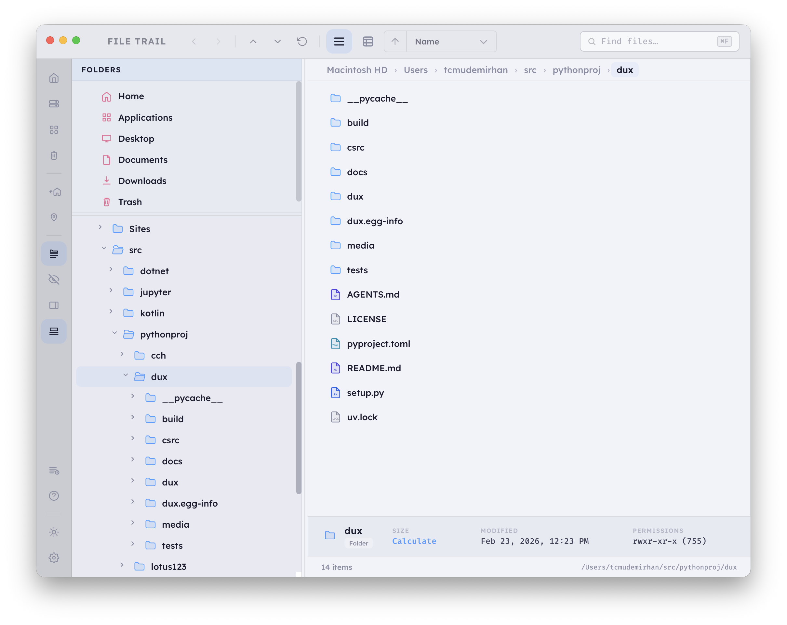

# File Trail

File Trail is a macOS file explorer built for people who spend real time inside project trees. It combines a native-feeling browser with fast search, on-demand folder size analysis, keyboard-friendly navigation, and a level of visual customization that most file managers never bother to offer.

It is built with Electron, React, TypeScript, Bun, and a small native macOS layer where raw filesystem performance matters.

<a href="docs/screenshots/screenshotsearch.png">
  
</a>

<a href="docs/screenshots/screenshotlight.png">
  
</a>

[Browse the full screenshot gallery](docs/screenshots)

## Why File Trail

Finder is great until you need to move fast through large folder trees, inspect structure, search deeply, compare files, and keep a workspace tuned to your own habits. File Trail is aimed at developers, power users, and anyone who wants a file browser that feels deliberate instead of generic.

## Highlights

- Fast search powered by a bundled `fd` binary, so search is built into the app and does not depend on the user setting up extra tools.
- Search controls that let you switch between regex and glob matching, target names or full paths, recurse deeply or stay shallow, and include hidden files when needed.
- Search result tooling for sorting, live filtering, and quickly drilling into large result sets without losing context.
- On-demand folder size calculation with cached results, so you can inspect heavy directories without paying the cost every time you click around.
- Native folder analysis that tracks logical size, allocated disk usage, and file counts for directory trees.
- A dual-pane workflow with folder tree navigation, content browsing, favorites, and an inspector-style Get Info panel.
- File operations for opening, editing, renaming, duplicating, moving, copying, pasting, trashing, and opening locations in Terminal.
- An action log for reviewing recent file operations.

## Efficient Search

Search is one of the main reasons to use File Trail. The app runs a bundled `fd` binary under the hood, which makes file discovery feel dramatically faster than the slow, blocking search experiences people are used to in general-purpose file browsers.

If you work inside large codebases, monorepos, media folders, or messy home directories, this matters. You can search by filename or full path, choose regex or glob patterns, include hidden files when necessary, and refine the result list after the scan finishes. The result is a search flow that feels made for real work instead of occasional lookup.

## Folder Size Calculation

File Trail treats folder size as first-class information instead of an afterthought. Directory sizes are calculated on demand, cached, and exposed directly in the browsing experience so you can understand where space is going without leaving the app.

Under the hood, the app uses a native macOS implementation for recursive folder size analysis. That means it can surface:

- Logical size
- Allocated disk usage
- File count

This makes the app useful not just for navigation, but also for cleanup, audits, and understanding large project directories.

## Customization

File Trail has a much deeper customization surface than a typical file explorer. You can tailor both the look and the workflow:

- Multiple dark and light themes, including dedicated looks like Catppuccin Mocha, Tomorrow Night, Sand, and Warm Paper
- Multiple icon styles, including classic, color block, monoline, and vivid
- Accent color controls for the overall UI, toolbar actions, and favorite items
- UI font family, font size, font weight, and zoom controls
- List and details views with adjustable density and configurable detail columns
- Configurable toolbar items across the top bar, left rail and bottom rail
- Favorite locations with customizable icons and placement options
- Search defaults for pattern mode, match scope, recursion, hidden files, sorting, and filtering behavior
- Default text editor, Terminal app, and open-with application shortcuts

## Feature Set

- Quick access to Home, Applications, Trash, and custom favorites
- Tree browsing and content browsing in one focused workspace
- Built-in Get Info panel with copy path and open-in-Terminal actions
- Hidden file toggle
- Folders-first sorting
- Go to Folder support
- Keyboard shortcuts for common navigation and browsing actions
- Action log tracking for file operations

## Current Platform

File Trail is currently focused on macOS.

## Download

If you just want to use File Trail, you do not need to build it from source. Download a packaged release from the GitHub releases page:

[Download from GitHub Releases](https://github.com/mdemirhan/filetrail/releases)

Releases include downloadable macOS ZIP builds for the supported Mac architectures:

- `x64` for Intel Macs
- `arm64` for Apple Silicon Macs

If your Mac has an Apple Silicon chip like M1, M2, M3, or newer, choose `arm64`. If your Mac is Intel-based, choose `x64`.

### Install steps

1. Open the [releases page](https://github.com/mdemirhan/filetrail/releases).
2. Download the ZIP file that matches your Mac:
   - choose `arm64` for Apple Silicon
   - choose `x64` for Intel
3. Unzip the archive.
4. Move `File Trail.app` into your `Applications` folder.
5. Launch the app.

## Development

### Requirements

- macOS
- [Bun](https://bun.sh/)

### Install dependencies

```bash
bun install
```

### Run the desktop app locally

```bash
bun run desktop:start
```

This builds the desktop app, prepares icon assets, and launches Electron.

### Useful local commands

```bash
bun run typecheck
bun run test
bun run lint
```

### Package the macOS app

```bash
bun run desktop:make:mac
```

This creates a macOS app bundle plus distributables under `apps/desktop/out`.

## Project Layout

```text
apps/desktop   Electron main/preload/renderer code and packaging scripts
packages/*     Shared contracts, explorer logic, search runtime, and native filesystem support
```
