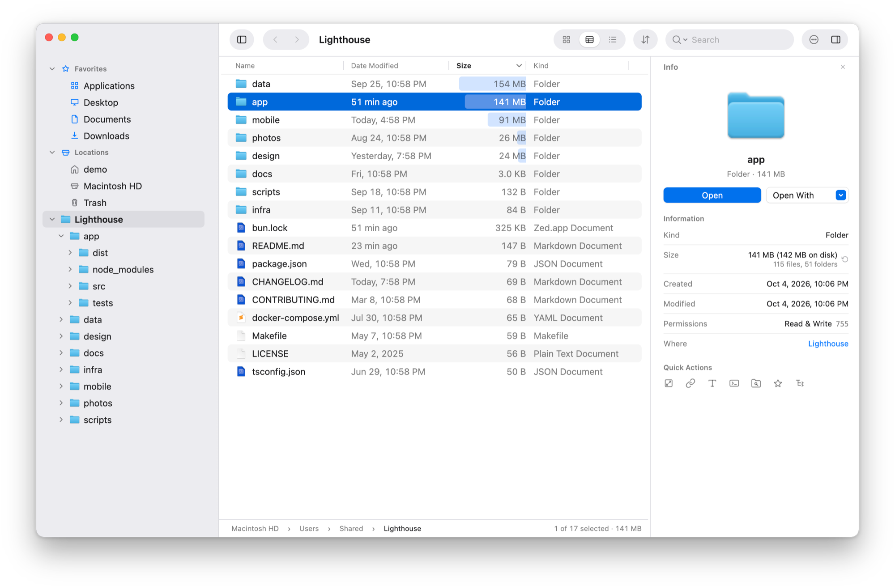
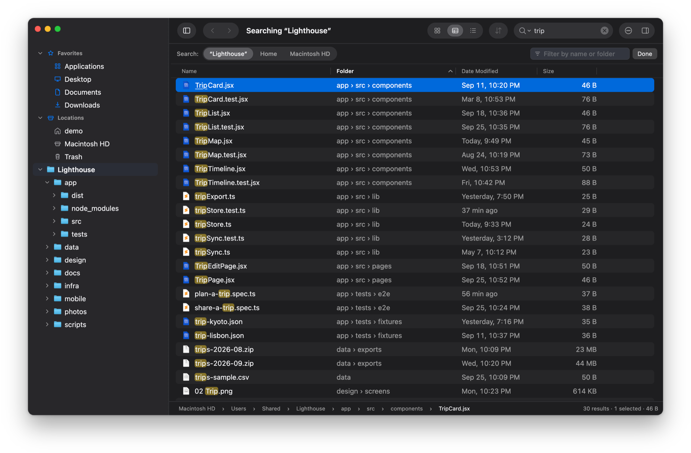
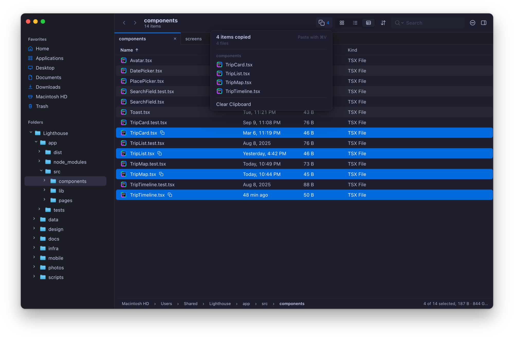
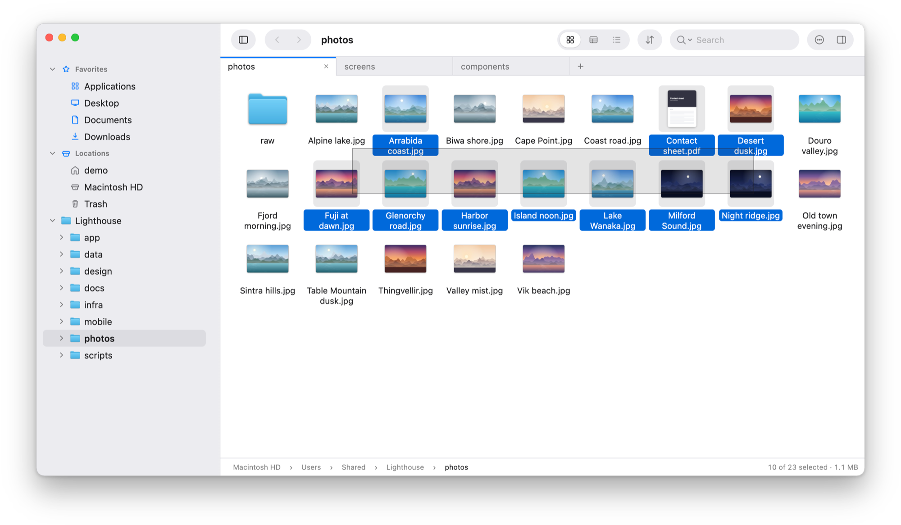
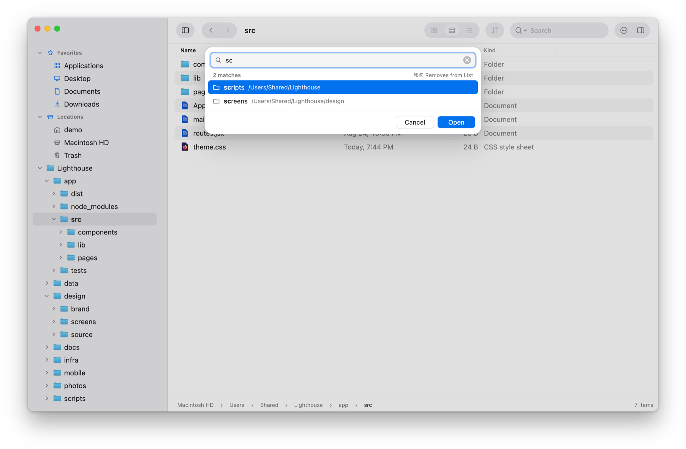
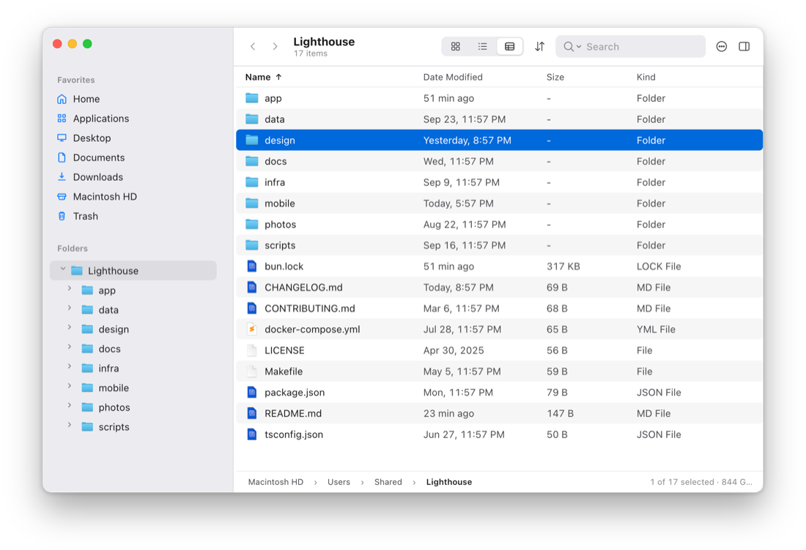
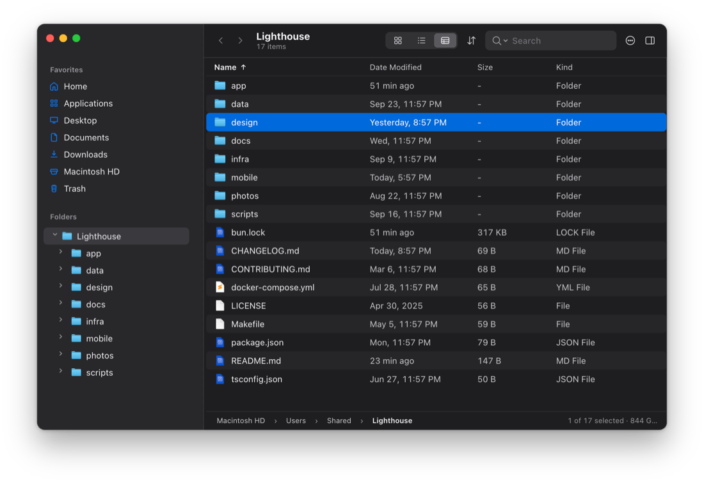
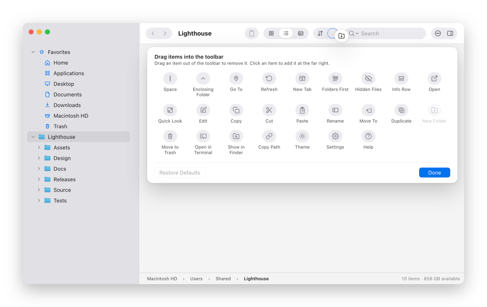
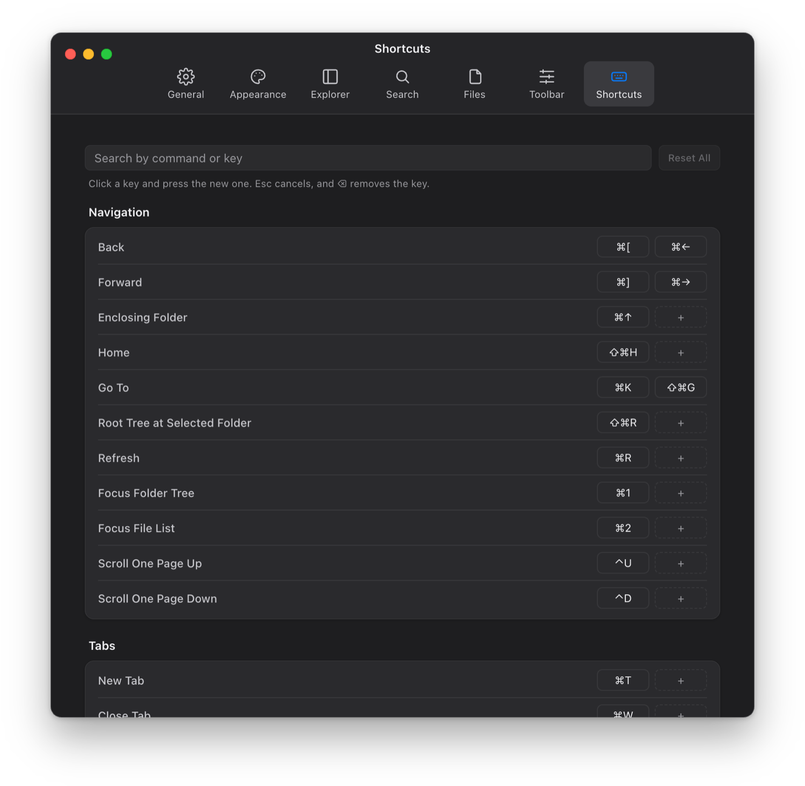

# File Trail

A file browser for macOS, built to fix the places where Finder falls short.

<p align="center">
  <picture>
    <source media="(prefers-color-scheme: dark)" srcset="docs/screenshots/folder-sizes-dark.png">
    
  </picture>
</p>

Finder covers the basics. File Trail is for the things it gets wrong or leaves out:

- **Search that works, and is fast.** Results appear as you type, by name or by full path, in plain text, glob or regex.
- **Type to filter.** Start typing in a folder and the list narrows to the names containing what you typed, where Finder only jumps to one.
- **A folder tree, not just a sidebar.** You see where you are and what is around it, instead of a flat list of favorites.
- **Tabs that keep their place.** Each has its own folder, history, view and search.
- **A clipboard you can see.** What you copied or cut stays marked, and listed in the toolbar, until you paste it.
- **Folder sizes when you ask.** One click measures a folder and everything in it, and shows what takes the space.
- **Yours to arrange.** The toolbar, the keyboard shortcuts and the accent color are all up to you.

The rest works the way you expect a Mac app to.

## Search that keeps up with your typing

Type in the search field and results appear as you type: files and folders under the folder you are in, each with the folder it lives in, sortable by name, folder, date or size.

<p align="center">
  
</p>

- **Plain text by default.** Switch to glob (`*.test.ts`) or regex when you need a pattern, and match against the name or the full path.
- **Widen or narrow without starting over.** One click moves the search from this folder to Home or the whole disk. The filter field trims what was already found, by name or by folder, without searching again.
- **It knows about Git.** Inside a repository, search can leave out `.git` and whatever `.gitignore` excludes, so build output stays out of the results.
- **Nothing to set up.** Search runs on a bundled copy of [`fd`](https://github.com/sharkdp/fd). There is no index to build and nothing to install.

Each tab keeps its own search, and a search keeps running while you look at another tab.

## See what is taking the space

Ask for a folder's size and File Trail measures it, and every folder inside it, in one pass. Sort the Details view by Size and each row gets a bar, so the heavy folders stand out before you read a single number. The first screenshot on this page shows it.

The Info panel gives the size, the number of items, and the space taken on disk when that differs. Sizes are worked out when you ask, not while you browse, so opening a large folder stays instant.

## Tabs, and a clipboard you can see

<p align="center">
  
</p>

Every tab has its own folder, history, folder tree, view, sort order and search. Copy in one tab and paste in another, or drag items onto a tab to move them there.

Copying a folder by mistake is easy to do and annoying to discover later, so File Trail makes the clipboard visible. Copied and cut items stay marked until they are pasted. A button in the toolbar counts them, and opens a list where you can jump to an item, take one off, or clear the lot.

When a paste would overwrite something, you decide what happens: replace, keep both, merge folders, or skip. Anything replaced goes to the Trash.

## Three views, with real previews

<p align="center">
  
</p>

Icon view shows Quick Look previews of photos, PDFs and other documents. List view packs a folder into compact columns. Details view adds date, size and kind, and optionally date created and permissions. Space opens Quick Look on whatever is selected.

Dates read the way you would say them ("24 min ago", "Yesterday, 6:03 PM"), and files and folders have the icons macOS itself draws for them.

## Get around without hunting

<p align="center">
  
</p>

- **The folder tree** shows the folder you are in and the ones around it. Open a folder's arrow to look inside without leaving where you are, or root the tree at one folder while you work inside a project.
- **Go To (⌘K)** finds any folder you have opened before, or a favorite, from a few letters of its name. The folders you use most come first. Start with `/` or `~` to type a path, and Tab completes it.
- **Type in the file list** to narrow it to the names containing what you typed. There is no field to click first: the first match is selected, Backspace edits what you typed, and Esc brings the rest back. Press ⌘F and the same text becomes a search of the subfolders.
- **The path bar** is more than a label: click a folder to jump to it, click a `›` to see the folders at that level and step sideways, or double-click the bar to edit the path as text.
- **Back and Forward** remember more than one step. Hold either button to pick from the folders it leads to.
- **Every command has a keyboard shortcut**, shown in the menus and listed in the built-in Help.

## Make it yours

File Trail follows the macOS Light and Dark setting, or stays in the one you pick.

<table>
  <tr>
    <td align="center"><br>Light</td>
    <td align="center"><br>Dark</td>
  </tr>
</table>

Beyond that, you choose the accent color and the zoom level, and the parts you touch most are yours to arrange:

<table>
  <tr>
    <td align="center" width="50%"><br><b>The toolbar.</b> Arranged where it is: drag buttons in, along or out, and watch it make room.</td>
    <td align="center" width="50%"><br><b>The keyboard.</b> Two keys per command, with a warning before one is taken from another command.</td>
  </tr>
</table>

Settings also covers the everyday choices: which app edits text files and which terminal opens, what double-click and Return do, which columns Details shows, what search starts with, and whether your tabs and last folder come back at launch.

## Also in the box

- Favorites in the sidebar, with an icon of your choice for each
- Open in Terminal and Copy Path on a key, and Open With for the apps you choose
- Rename, duplicate, move, new folder and Move to Trash
- Hidden files on a key (⇧⌘.), and folders kept first when you want them
- Built-in Help that follows the shortcuts you have set

## Install

Download the latest build from the [releases page](https://github.com/mdemirhan/filetrail/releases):

1. Download `FileTrail-arm64.zip`, the build for Apple Silicon Macs.
2. Unzip it and move `File Trail.app` into your Applications folder.
3. Open it.

File Trail runs on Apple Silicon Macs only. Releases are beta builds and can trail `main`; to run the newest version, build from source. It takes a few minutes.

## Build from source

You need an Apple Silicon Mac, [Bun](https://bun.sh/), and the Xcode Command Line Tools (`xcode-select --install`) for the native part.

```bash
bun install
bun run desktop:start
```

That builds the app and its native helpers and launches it. To make an app bundle under `apps/desktop/out`:

```bash
bun run desktop:make:mac:notarized   # signed and notarized, plus a ZIP and a disk image to share
bun run desktop:make:mac             # signed with your Developer ID, not notarized
bun run desktop:make:mac:adhoc       # signed ad hoc, for this Mac only
```

Signing uses the Developer ID Application certificate in `~/Documents/Apple Developer Certificates/developerID_application.cer` (or the one `MACOS_SIGN_CERT` names), with its private key in your keychain. Notarizing uses the `notarytool` keychain profile `filetrail` (or the one `MACOS_NOTARY_PROFILE` names); create it once with `xcrun notarytool store-credentials filetrail --apple-id <email> --team-id <team ID>`. `apps/desktop/scripts/make-macos-app.sh --help` has the details.

While working on the code:

```bash
bun run typecheck
bun run test
bun run lint
```

## How it is built

File Trail is an Electron app written in TypeScript and React, with a small native layer in C and Objective-C where the filesystem work has to be fast or has to be done the way macOS does it: copying, folder sizes, file icons and Quick Look previews.

```text
apps/desktop        The app: Electron main process, preload and the React interface
packages/contracts  The messages the interface and the main process exchange
packages/core       Listing, search, and copy, move and paste
packages/native-fs  The native macOS helpers
```
